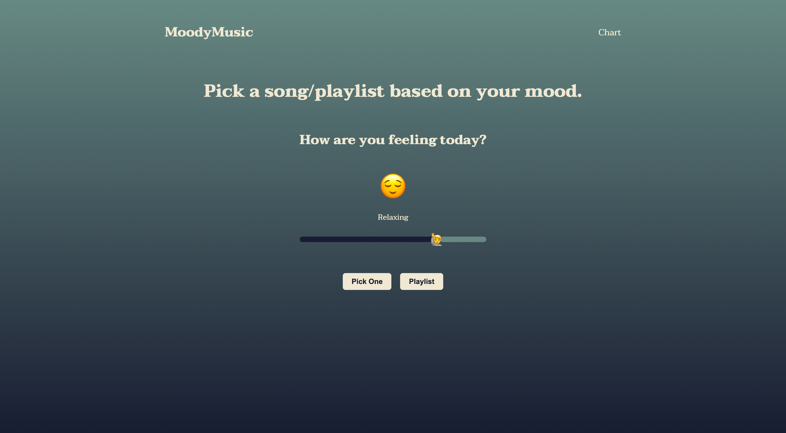
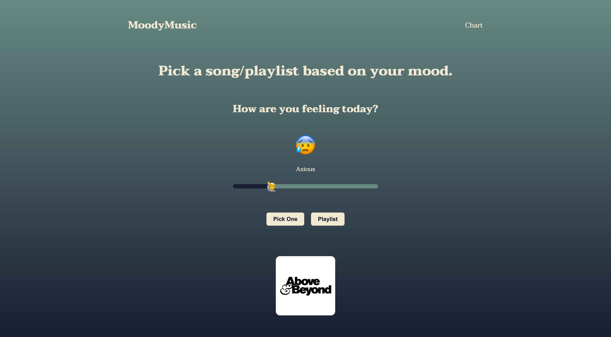
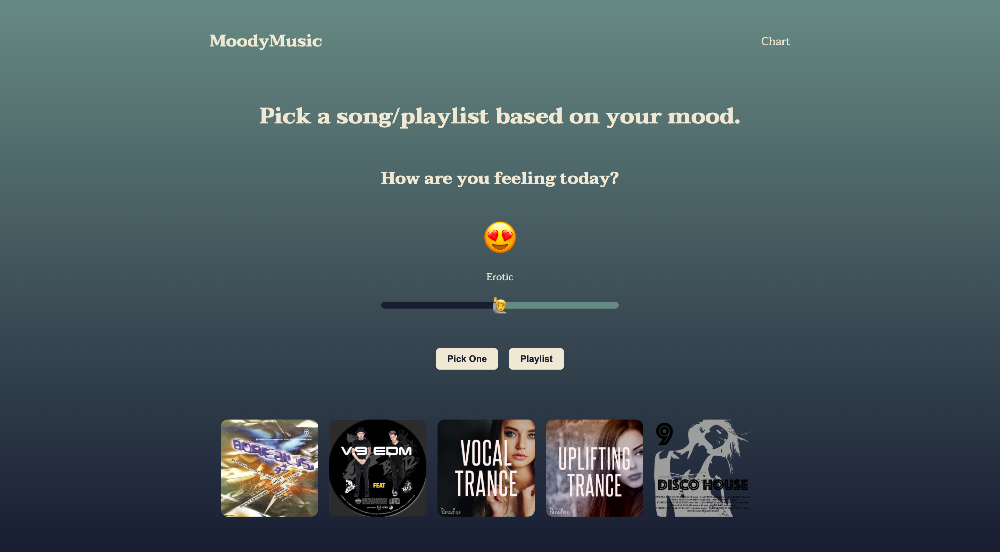

# MoodyMusic

## Overview

When we want to listen to music depending to our mood, where we at and surrounding environment but don’t know what song is really fit at that time. So this become our motivation to do music mood web application.

Available Moods

- Joyful
- Relaxing
- Erotic
- Axious
- Sad

## Features

- Get a song based on your mood and location

- Get playlist based on your mood and location

## Requirements

- Node.js 14.18.1+

## Dependencies

- Server

| Dependencies       | Version |
| ------------------ | ------- |
| axios              | 0.24.0  |
| cors               | 2.8.5   |
| express            | 4.17.1  |
| mongoose           | 6.0.13  |
| swagger-ui-express | 4.2.0   |
| dotenv             | 10.0.0  |
| nodemon            | 2.0.15  |

- Web

| Dependencies     | Version |
| ---------------- | ------- |
| axios            | 0.24.0  |
| autoprefixer     | 10.4.0  |
| parcel           | 2.0.1   |
| postcss-import   | 14.0.2  |
| posthtml-extend  | 0.6.1   |
| posthtml-include | 1.7.2   |

## Getting Started

Install dependencies for both web and server:

`npm install`

Run server:

`npm run devStart`

Run web:

`npm run dev`

Visit web application at: <http://localhost:1234>

Visit swagger ui documentation at: <http://localhost:3000/api-docs>

## Team Members

1. Bannakorn Sinlapaoranukl
2. Pittayut Benjamasutin
3. Tatpol Samakpong

_Software and Knowledge Engineering_  
Faculty of Engineering  
Kasetsart University
